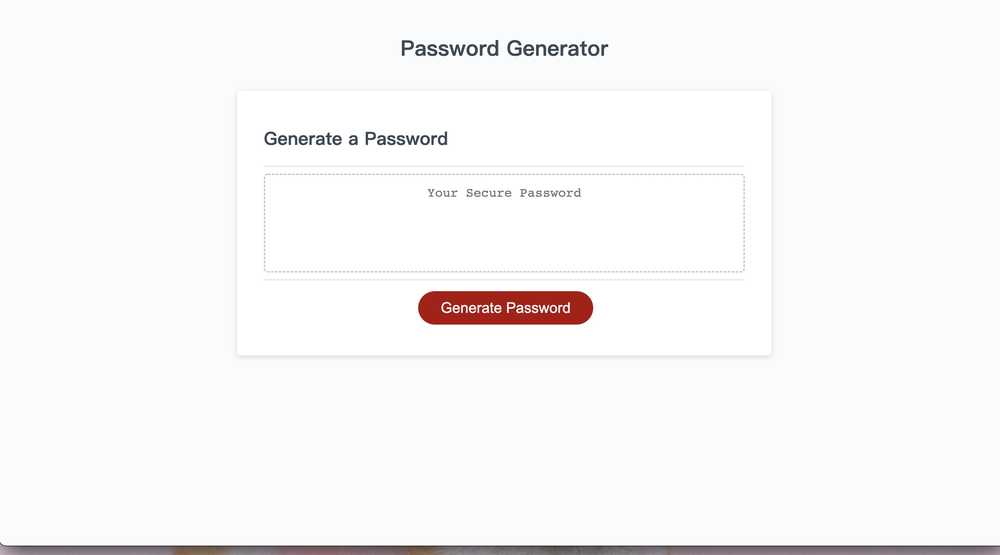
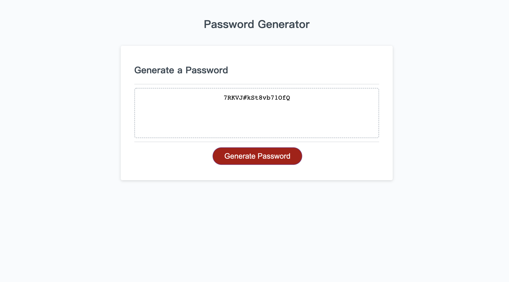

# Password_Generator

## Description

Create an application that an employee can use to generate a random password based on their selected criteria.

deployed link: https://github.com/kaihuan-huang/Password_Generator

Gitpage link: https://kaihuan-huang.github.io/Password_Generator/

-presented with a series of prompts for password criteria.

-prompted for the length of the password(length of at least 8 characters and no more than 128 characters)

-confirm whether or not to include lowercase, uppercase, numeric, and/or special characters on each prompt

## Assets

The following images demonstrate the web application's appearance and functionality:

## Resources:

https://youtu.be/O-79Cb5s9U4
